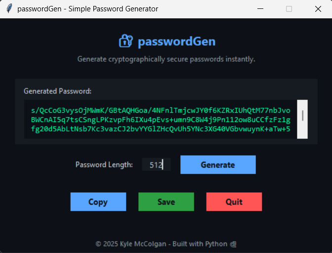

# **passwordGen**

Securely generate strong passwords with ease using `passwordGen`, a Python-based GUI application. Whether you need a quick password for personal use or a robust one for secure environments, `passwordGen` simplifies the process while prioritizing usability and security.

---

## **Features**
- **User-friendly GUI** built with `Tkinter` for intuitive interaction.
- **Customizable password length** with support for lengths between 8 and 512 characters.
- **Password display** with a scrollable text box for readability.
- **Copy to clipboard** functionality for quick usage.
- **Save to file** feature to keep generated passwords secure.
- **Secure generation** using Python's `secrets` and `base64` libraries for cryptographically strong passwords.

---

## **How It Works**
1. Set the desired password length (default: 64 for strong security).
2. Click **Generate** to create a password.
3. Use the **Copy** button to send the password to your clipboard or **Save** to store it in a file.
4. The application ensures your password is securely generated and easily accessible.

---

## **Getting Started**

### Prerequisites
- Python 3.8 or later
- Libraries: `tkinter`

### Installation
1. Clone the repository:
   ```bash
   git clone https://github.com/mcckyle/passwordGen.git
   cd passwordGen
   ```
2. Run the application:
   ```bash
   python passwordGen.py
   ```

---

## **Screenshots**



> *Example of the clean and intuitive user interface provided by passwordGen.*

---

## **Security**
`passwordGen` leverages:
- **Python’s `secrets` library**, ensuring randomness suitable for security purposes.
- **Base64 encoding**, providing easily shareable yet complex password strings.

---

## **Future Improvements**
- Add more password customization options (e.g., include/exclude special characters).
- Enhance user interface design for modern aesthetics.
- Implement password strength indicators.

---

## **Contributing**
Contributions are welcome! Feel free to open issues or submit pull requests to improve `passwordGen`.

---

## **License**
This project is licensed under the [MIT License](LICENSE).

---

## **Contact**
Developed in Saint Louis by Kyle McColgan. Connect with me on [LinkedIn](https://www.linkedin.com/in/kylemccolgan).

---

## **Acknowledgements**
Special thanks to the Python community for providing tools and libraries that make secure password generation simple and effective.
